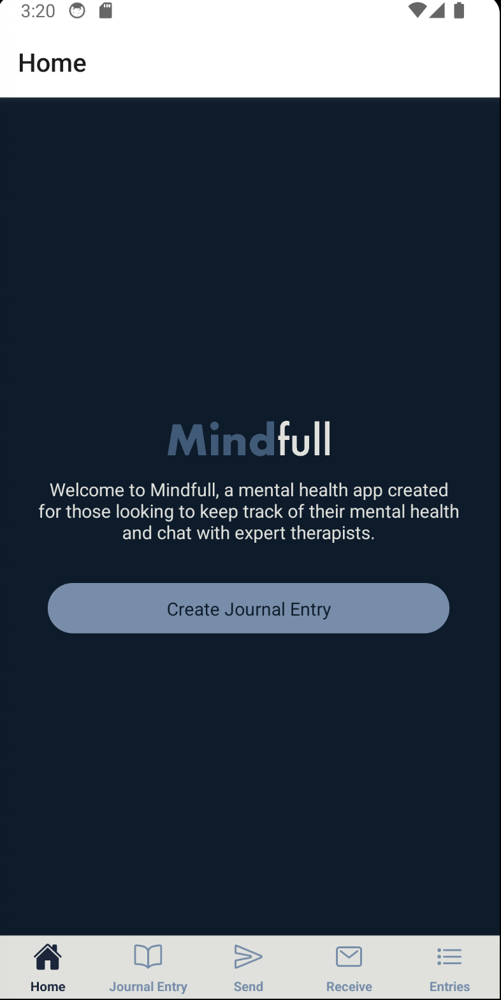
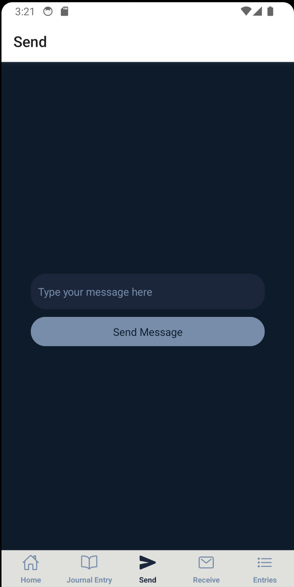

Made by: Matt Gisin

Here's a quick summary of my app, Mindfull. It's a mental health tracking app that allows users to journal their daily feelings, talk directly to therapisits, and improve their mental health.

The target audience is people who want to improve their mental health, this can be anyone really. People who are stressed at work, with school, or just their daily lives.

Here's a few screenshots of the front end of the development, a simple blue and white app with a clean landing page, a journal entry section and a place to send and recieve messages from therapists. 

Server APIs

GET: This endpoint gets all messages from the database. The server response is a JSON object containing all messages.

POST: This endpoint posts a new message to the database. It requires one parameter:
The content of the messages to be added by user. The server response is a JSON object with the message "Message inserted".

(Journal) GET: This endpoint gets all journals from the database. The server response is also a JSON object containing all journal entries.

(Journal) POST: This endpoint posts a new journal entry to the database. It requires one parameter: The server response is a JSON object with the message "Journal entry inserted".

For data storage, I'm using the app TablePlus. The rows and columns store a particualr type of data. Theres one set for messages and one for journals. 

I'm also using Drexel CCI's SSH server to act as a place to send information and display it as well.
