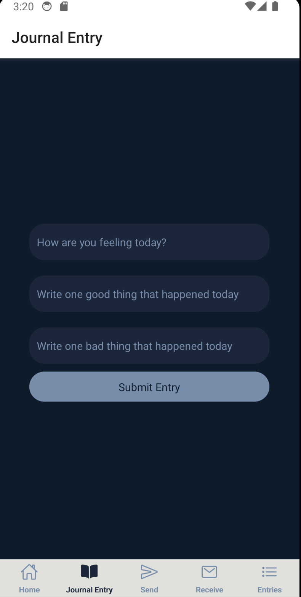

Made by: Matt Gisin

Here's a quick summary of my app, Mindfull. It's a mental health tracking app that allows users to journal their daily feelings, talk directly to therapisits, and improve their mental health.

The target audience is people who want to improve their mental health, this can be anyone really. People who are stressed at work, with school, or just their daily lives.

Here's a few screenshots of the front end of the development, a simple blue and white app with a clean landing page, a journal entry section and a place to send and recieve messages from therapists. 

Here is the homepage, where it prompts the user to create a journal entry, bringing you to the journal entry screen.

This is the journal entry screen that asks the user to submit three fields, one for how they're feeling today, one for one good thing and one bad thing that happened to them that day. 

These Journal entries are saved in a MySQL database on TablePlus. That screenshot will be under this one. 

Here is the screen for sending a message to your therapist. Currently, it sends your message and then creates a dummy message right after it, so when you click receive messages, it displays your message with a "response" from a therapist.

Here's the messaging screen. As you can see, the response is in Lorem Ipsum but in the future, I'd like to make it where its a database where you can message back and forth to provide the user with that real time chatting to a therapist.

Server APIs

GET: This endpoint gets all messages from the database. The server response is a JSON object containing all messages.

POST: This endpoint posts a new message to the database. It requires one parameter:
The content of the messages to be added by user. The server response is a JSON object with the message "Message inserted".

(Journal) GET: This endpoint gets all journals from the database. The server response is also a JSON object containing all journal entries.

(Journal) POST: This endpoint posts a new journal entry to the database. It requires one parameter: The server response is a JSON object with the message "Journal entry inserted".

For data storage, I'm using the app TablePlus. The rows and columns store data and is saved in http://node.cci.drexel.edu:9378/api/messages and http://node.cci.drexel.edu:9378/api/journals respectively.

I'm also using Drexel CCI's SSH server as an access point for the data to pass through. 

NEXT STEPS

I will be further developing a screen for users to See all of their previous jounral entries to refelct on what that have logged in the past. 
